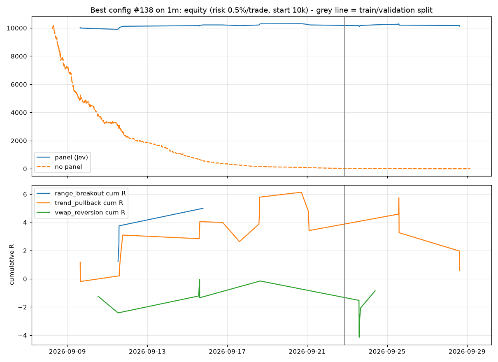
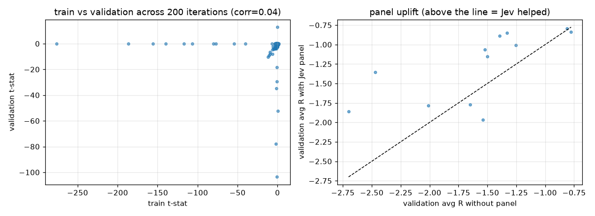

# Optimisation report (1m, panel=jev)

Iterations: 200. Split: 2026-09-22 20:40:00+00:00 (train 15 d / validation 6 d). Coins: BTC, ETH, ZEC, HYPE, NEAR, SOL, PUMP, XRP, ONDO, ENA.

## Search summary

```
{
 "iterations": 200,
 "with_train_trades_ge_30": 32,
 "corr_train_val_tstat": 0.04329539425679566,
 "share_val_positive_R_all": 0.085,
 "share_val_positive_R_top20_by_train": 0.2,
 "panel_uplift_val_R_median": 0.29627193660771045,
 "panel_uplift_val_R_share_positive": 0.75,
 "no_panel_val_R_median": -0.9896680217018932,
 "entry_mode_val_R_median": {
  "limit": -1.035,
  "market": -1.606
 }
}
```

## Top 10 by train objective (t-stat of R x min(1, n/60)); v_* = validation, np_* = same signals without the panel

| iter | obj | entry | sl | tp | max_bars | mr | pb | bo | thr | t_n | t_R | t_pf | t_wr | t_ret | t_dd | v_n | v_R | v_pf | v_wr | v_ret | v_dd | np_v_n | np_v_R |
|---|---|---|---|---|---|---|---|---|---|---|---|---|---|---|---|---|---|---|---|---|---|---|---|
| 138 | 0.468 | limit | 1.130 | 1.500 | 9 | True | True | True | 0.354 | 26 | 0.221 | 1.832 | 0.654 | 1.538 | -1.245 | 12 | -0.294 | 0.696 | 0.417 | -0.814 | -1.591 | 35 | -0.479 |
| 161 | 0.401 | limit | 0.780 | 2.930 | 36 | False | True | True | 0.426 | 23 | 0.540 | 1.424 | 0.391 | 2.774 | -2.087 | 4 | -0.248 | 0.753 | 0.250 | -0.191 | -1.492 | 36 | -1.202 |
| 111 | 0.319 | limit | 1.000 | 1.610 | 18 | True | True | True | 0.511 | 11 | 0.662 | 3.215 | 0.727 | 3.088 | -0.327 | 0 | 0.000 | 0.000 | 0.000 | 0.000 | 0.000 | 4 | -0.584 |
| 16 | 0.223 | limit | 1.080 | 2.640 | 18 | True | True | True | 0.587 | 12 | 0.566 | 2.420 | 0.583 | 3.034 | -0.972 | 5 | -0.349 | 0.564 | 0.400 | -0.660 | -1.012 | 26 | -0.668 |
| 20 | 0.217 | limit | 1.030 | 2.220 | 36 | False | True | True | 0.427 | 10 | 0.695 | 1.709 | 0.600 | 2.038 | -0.888 | 2 | 0.287 | 1.467 | 0.500 | 0.211 | -0.527 | 23 | -0.973 |
| 182 | 0.181 | limit | 1.320 | 1.890 | 18 | True | True | False | 0.405 | 26 | 0.099 | 1.290 | 0.577 | 1.366 | -1.944 | 13 | -0.179 | 0.873 | 0.462 | -1.239 | -2.561 | 340 | -1.316 |
| 102 | 0.159 | limit | 1.080 | 1.830 | 36 | True | True | True | 0.594 | 18 | 0.206 | 0.897 | 0.444 | 1.352 | -2.623 | 5 | -0.209 | 0.733 | 0.400 | -0.398 | -1.009 | 29 | -0.515 |
| 81 | 0.086 | market | 1.490 | 2.930 | 9 | True | True | True | 0.435 | 8 | 0.279 | 1.699 | 0.625 | 0.830 | -0.886 | 0 | 0.000 | 0.000 | 0.000 | 0.000 | 0.000 | 0 | 0.000 |
| 84 | 0.081 | limit | 1.270 | 2.100 | 48 | True | True | True | 0.604 | 7 | 0.369 | 1.413 | 0.571 | 1.313 | -0.717 | 1 | 1.572 | 99.000 | 1.000 | 0.590 | 0.000 | 32 | -0.587 |
| 142 | 0.070 | limit | 1.010 | 2.960 | 18 | True | True | True | 0.643 | 7 | 0.474 | 2.072 | 0.429 | 1.558 | -1.024 | 3 | -1.394 | 0.000 | 0.000 | -1.560 | -1.030 | 210 | -1.751 |

## Best config #138

```
{
 "setup": {
  "mr_enabled": true,
  "mr_dist_atr": 2.902,
  "mr_rsi_low": 30.777,
  "mr_rsi_high": 64.162,
  "mr_wick_min": 0.485,
  "mr_vol_z_min": 1.401,
  "mr_max_htf_slope": 1.05,
  "pb_enabled": true,
  "pb_min_htf_slope": 0.301,
  "pb_rsi_lo": 41.234,
  "pb_rsi_hi": 68.159,
  "pb_touch_tol_atr": 0.202,
  "bo_enabled": true,
  "bo_vol_z_min": 2.28,
  "bo_atr_regime_min": 1.074,
  "bo_min_body": 0.714,
  "sl_atr": 1.13,
  "tp_atr": 1.5,
  "max_bars": 9,
  "sessions": [
   "asia",
   "europe",
   "us",
   "late"
  ],
  "entry_mode": "limit",
  "tp_mode": "atr",
  "min_atr_cost_ratio": 1.5,
  "cost_bps_ref": 10.0
 },
 "panel": {
  "enabled": true,
  "w_setup": 0.65,
  "w_regime": 0.7,
  "w_htf": 0.01,
  "w_exhaustion": 0.92,
  "w_cost": 1.42,
  "w_quality": 1.11,
  "threshold": 0.354,
  "min_action_conf": 0.4,
  "veto_skip": false,
  "size_by_quality": true
 }
}
```

### Best config: train vs validation

| split | n_trades | win_rate | avg_r | expectancy_pct | profit_factor | total_return_pct | max_drawdown_pct | sharpe_trade | avg_bars | pct_target | pct_stop | trades_per_day |
|---|---|---|---|---|---|---|---|---|---|---|---|---|
| train | 28 | 0.679 | 0.295 | 0.104 | 2.351 | 2.178 | -1.245 | 1.220 | 5.429 | 0.429 | 0.250 | 1.904 |
| validation | 12 | 0.417 | -0.294 | -0.046 | 0.696 | -0.814 | -1.591 | -0.565 | 4.333 | 0.333 | 0.500 | 1.904 |

### Best config: by setup (all trades)

| setup | n | win_rate | avg_r | expectancy_pct | sum_net_pct |
|---|---|---|---|---|---|
| range_breakout | 4 | 1.000 | 1.249 | 0.489 | 1.956 |
| trend_pullback | 24 | 0.583 | 0.024 | 0.027 | 0.653 |
| vwap_reversion | 12 | 0.500 | -0.071 | -0.021 | -0.251 |

### Best config: by coin (all trades)

| coin | n | win_rate | avg_r | expectancy_pct | sum_net_pct |
|---|---|---|---|---|---|
| BTC | 8 | 0.625 | 0.097 | 0.065 | 0.520 |
| ETH | 32 | 0.594 | 0.123 | 0.057 | 1.838 |

### Best config: by direction

| direction | n | win_rate | avg_r | expectancy_pct | sum_net_pct |
|---|---|---|---|---|---|
| -1.000 | 16.000 | 0.500 | 0.011 | 0.006 | 0.103 |
| 1.000 | 24.000 | 0.667 | 0.190 | 0.094 | 2.255 |

### Best config: by exit reason

| reason | n | win_rate | avg_r | expectancy_pct | sum_net_pct |
|---|---|---|---|---|---|
| stop | 13 | 0.000 | -1.318 | -0.285 | -3.711 |
| target | 16 | 1.000 | 1.203 | 0.320 | 5.126 |
| time | 11 | 0.727 | 0.238 | 0.086 | 0.942 |




