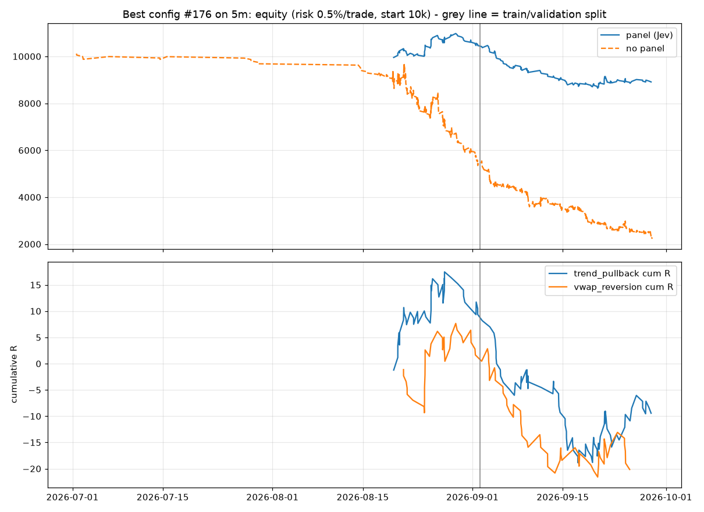
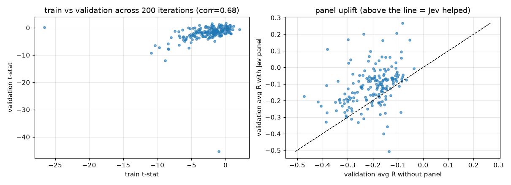

# Optimisation report (5m, panel=jev)

Iterations: 200. Split: 2026-09-02 04:34:00+00:00 (train 63 d / validation 27 d). Coins: BTC, ETH, ZEC, HYPE, NEAR, SOL, PUMP, XRP, ONDO, ENA.

## Search summary

```
{
 "iterations": 200,
 "with_train_trades_ge_30": 161,
 "corr_train_val_tstat": 0.6761788099080979,
 "share_val_positive_R_all": 0.16,
 "share_val_positive_R_top20_by_train": 0.2,
 "panel_uplift_val_R_median": 0.08186036479552274,
 "panel_uplift_val_R_share_positive": 0.8522727272727273,
 "no_panel_val_R_median": -0.18577148590034886,
 "entry_mode_val_R_median": {
  "limit": -0.089,
  "market": -0.163
 }
}
```

## Top 10 by train objective (t-stat of R x min(1, n/60)); v_* = validation, np_* = same signals without the panel

| iter | obj | entry | sl | tp | max_bars | mr | pb | bo | thr | t_n | t_R | t_pf | t_wr | t_ret | t_dd | v_n | v_R | v_pf | v_wr | v_ret | v_dd | np_v_n | np_v_R |
|---|---|---|---|---|---|---|---|---|---|---|---|---|---|---|---|---|---|---|---|---|---|---|---|
| 176 | 0.709 | limit | 0.710 | 1.750 | 36 | True | True | True | 0.644 | 82 | 0.135 | 1.056 | 0.366 | 4.658 | -4.661 | 144 | -0.282 | 0.748 | 0.250 | -14.839 | -17.387 | 983 | -0.172 |
| 126 | 0.628 | limit | 1.440 | 3.080 | 18 | True | True | True | 0.624 | 146 | 0.070 | 1.205 | 0.438 | 3.617 | -3.394 | 188 | 0.095 | 1.098 | 0.447 | 7.199 | -4.969 | 736 | -0.087 |
| 33 | 0.618 | market | 1.410 | 2.310 | 24 | False | False | True | 0.456 | 68 | 0.101 | 1.226 | 0.456 | 1.596 | -2.858 | 141 | -0.176 | 0.822 | 0.355 | -6.670 | -9.057 | 281 | -0.294 |
| 159 | 0.522 | limit | 0.810 | 2.020 | 9 | False | True | False | 0.473 | 53 | 0.131 | 1.409 | 0.434 | 3.359 | -5.028 | 69 | -0.049 | 0.919 | 0.348 | -1.894 | -4.492 | 607 | -0.177 |
| 78 | 0.456 | limit | 1.440 | 1.810 | 6 | True | True | False | 0.748 | 67 | 0.051 | 1.118 | 0.537 | 1.647 | -3.549 | 121 | -0.044 | 0.914 | 0.496 | -2.783 | -4.883 | 1328 | -0.080 |
| 42 | 0.424 | market | 1.600 | 3.010 | 9 | True | True | True | 0.390 | 271 | 0.028 | 1.096 | 0.461 | 3.456 | -8.678 | 425 | -0.082 | 0.875 | 0.412 | -16.501 | -19.449 | 2328 | -0.105 |
| 24 | 0.375 | limit | 1.070 | 1.710 | 9 | True | True | True | 0.680 | 29 | 0.197 | 1.068 | 0.483 | 1.806 | -1.558 | 63 | 0.056 | 1.014 | 0.444 | 1.259 | -1.971 | 872 | -0.087 |
| 200 | 0.375 | limit | 1.110 | 2.680 | 12 | True | True | True | 0.724 | 35 | 0.176 | 1.219 | 0.343 | 2.057 | -3.471 | 71 | 0.167 | 1.293 | 0.451 | 5.588 | -3.479 | 3649 | -0.298 |
| 36 | 0.372 | limit | 0.800 | 1.610 | 18 | True | True | True | 0.655 | 96 | 0.063 | 1.056 | 0.375 | 2.475 | -6.877 | 183 | -0.073 | 0.954 | 0.350 | -5.767 | -7.634 | 1381 | -0.141 |
| 183 | 0.358 | market | 1.320 | 2.370 | 36 | False | True | False | 0.574 | 166 | 0.038 | 1.236 | 0.422 | 2.583 | -5.941 | 264 | -0.070 | 0.933 | 0.383 | -7.308 | -10.475 | 852 | -0.123 |

## Best config #176

```
{
 "setup": {
  "mr_enabled": true,
  "mr_dist_atr": 2.157,
  "mr_rsi_low": 25.031,
  "mr_rsi_high": 62.571,
  "mr_wick_min": 0.208,
  "mr_vol_z_min": 1.995,
  "mr_max_htf_slope": 0.662,
  "pb_enabled": true,
  "pb_min_htf_slope": 0.264,
  "pb_rsi_lo": 41.891,
  "pb_rsi_hi": 64.651,
  "pb_touch_tol_atr": 0.225,
  "bo_enabled": true,
  "bo_vol_z_min": 2.93,
  "bo_atr_regime_min": 1.268,
  "bo_min_body": 0.737,
  "sl_atr": 0.71,
  "tp_atr": 1.75,
  "max_bars": 36,
  "sessions": [
   "europe",
   "us"
  ],
  "entry_mode": "limit",
  "tp_mode": "atr",
  "min_atr_cost_ratio": 4.0,
  "cost_bps_ref": 10.0
 },
 "panel": {
  "enabled": true,
  "w_setup": 1.42,
  "w_regime": 1.31,
  "w_htf": 0.8,
  "w_exhaustion": 0.74,
  "w_cost": 0.35,
  "w_quality": 0.42,
  "threshold": 0.644,
  "min_action_conf": 0.4,
  "veto_skip": true,
  "size_by_quality": true
 }
}
```

### Best config: train vs validation

| split | n_trades | win_rate | avg_r | expectancy_pct | profit_factor | total_return_pct | max_drawdown_pct | sharpe_trade | avg_bars | pct_target | pct_stop | trades_per_day |
|---|---|---|---|---|---|---|---|---|---|---|---|---|
| train | 82 | 0.366 | 0.134 | 0.020 | 1.056 | 4.645 | -4.661 | 0.825 | 4.476 | 0.366 | 0.634 | 1.301 |
| validation | 144 | 0.250 | -0.282 | -0.096 | 0.748 | -14.839 | -17.386 | -2.359 | 3.340 | 0.250 | 0.750 | 5.330 |

### Best config: by setup (all trades)

| setup | n | win_rate | avg_r | expectancy_pct | sum_net_pct |
|---|---|---|---|---|---|
| trend_pullback | 130 | 0.308 | -0.073 | -0.051 | -6.690 |
| vwap_reversion | 96 | 0.271 | -0.210 | -0.058 | -5.540 |

### Best config: by coin (all trades)

| coin | n | win_rate | avg_r | expectancy_pct | sum_net_pct |
|---|---|---|---|---|---|
| ENA | 51 | 0.392 | 0.238 | 0.095 | 4.853 |
| ETH | 5 | 0.600 | 0.935 | 0.286 | 1.429 |
| HYPE | 2 | 0.500 | 0.575 | 0.171 | 0.341 |
| NEAR | 66 | 0.212 | -0.412 | -0.149 | -9.852 |
| ONDO | 1 | 0.000 | -1.229 | -0.458 | -0.458 |
| PUMP | 10 | 0.100 | -0.839 | -0.334 | -3.336 |
| SOL | 11 | 0.545 | 0.742 | 0.214 | 2.354 |
| XRP | 18 | 0.278 | -0.204 | -0.042 | -0.756 |
| ZEC | 62 | 0.258 | -0.245 | -0.110 | -6.806 |

### Best config: by direction

| direction | n | win_rate | avg_r | expectancy_pct | sum_net_pct |
|---|---|---|---|---|---|
| -1.000 | 124.000 | 0.250 | -0.284 | -0.113 | -14.007 |
| 1.000 | 102.000 | 0.343 | 0.056 | 0.017 | 1.776 |

### Best config: by exit reason

| reason | n | win_rate | avg_r | expectancy_pct | sum_net_pct |
|---|---|---|---|---|---|
| stop | 160 | 0.000 | -1.172 | -0.529 | -84.681 |
| target | 66 | 1.000 | 2.392 | 1.098 | 72.450 |




