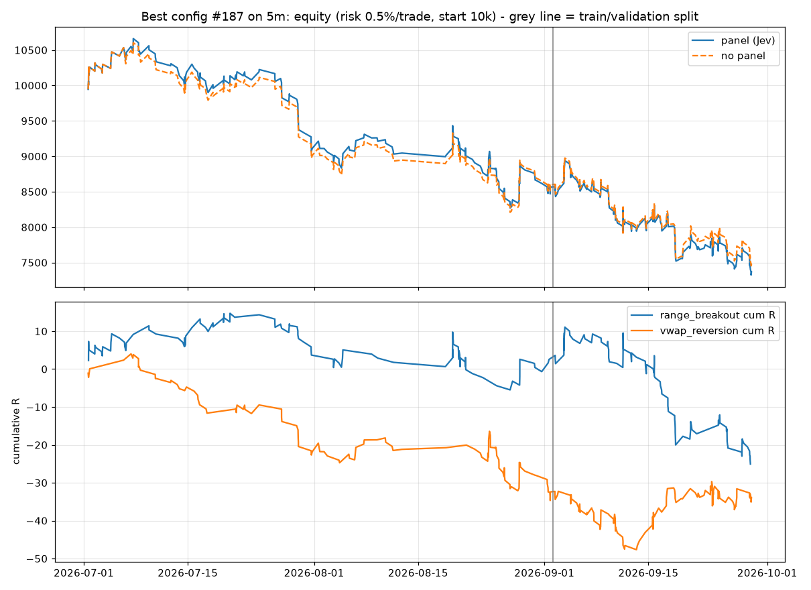
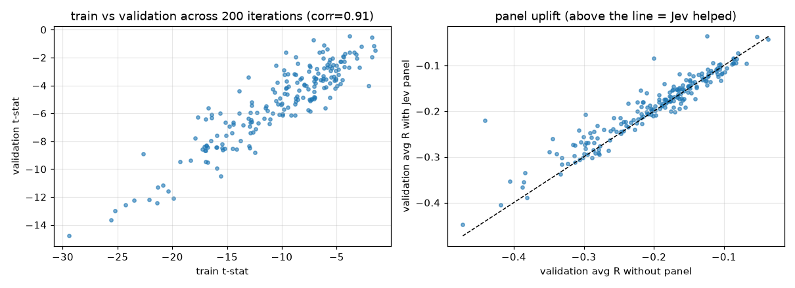

# Optimisation report (5m, panel=mock)

Iterations: 200. Split: 2026-09-02 04:13:00+00:00 (train 63 d / validation 27 d). Coins: BTC, ETH, ZEC, HYPE, NEAR, SOL, PUMP, XRP, ONDO, ENA.

## Search summary

```
{
 "iterations": 200,
 "with_train_trades_ge_30": 200,
 "corr_train_val_tstat": 0.9136071980310941,
 "share_val_positive_R_all": 0.0,
 "share_val_positive_R_top20_by_train": 0.0,
 "panel_uplift_val_R_median": 0.006049850461308778,
 "panel_uplift_val_R_share_positive": 0.64,
 "no_panel_val_R_median": -0.18506976411157502,
 "entry_mode_val_R_median": {
  "limit": -0.173,
  "market": -0.206
 }
}
```

## Top 10 by train objective (t-stat of R x min(1, n/60)); v_* = validation, np_* = same signals without the panel

| iter | obj | entry | sl | tp | max_bars | mr | pb | bo | thr | t_n | t_R | t_pf | t_wr | t_ret | t_dd | v_n | v_R | v_pf | v_wr | v_ret | v_dd | np_v_n | np_v_R |
|---|---|---|---|---|---|---|---|---|---|---|---|---|---|---|---|---|---|---|---|---|---|---|---|
| 187 | -1.459 | limit | 1.380 | 3.190 | 12 | True | False | True | 0.528 | 246 | -0.125 | 0.797 | 0.337 | -14.709 | -22.678 | 250 | -0.119 | 0.810 | 0.360 | -14.237 | -18.294 | 251 | -0.109 |
| 55 | -1.570 | limit | 1.310 | 3.160 | 24 | False | False | True | 0.602 | 354 | -0.124 | 0.808 | 0.302 | -23.345 | -29.728 | 250 | -0.109 | 0.849 | 0.300 | -15.702 | -27.283 | 251 | -0.112 |
| 90 | -1.755 | market | 0.720 | 1.140 | 60 | True | False | False | 0.521 | 256 | -0.146 | 0.827 | 0.414 | -18.133 | -27.701 | 172 | -0.197 | 0.779 | 0.390 | -16.793 | -18.466 | 176 | -0.204 |
| 44 | -1.757 | limit | 1.090 | 3.080 | 18 | True | True | True | 0.610 | 693 | -0.106 | 0.927 | 0.302 | -34.447 | -39.374 | 526 | -0.037 | 0.924 | 0.314 | -12.725 | -28.671 | 541 | -0.053 |
| 33 | -2.088 | market | 1.410 | 2.310 | 24 | False | False | True | 0.456 | 297 | -0.156 | 0.787 | 0.370 | -24.238 | -27.786 | 281 | -0.295 | 0.665 | 0.310 | -38.527 | -39.878 | 281 | -0.295 |
| 152 | -2.741 | limit | 0.820 | 2.440 | 18 | True | True | False | 0.424 | 318 | -0.248 | 0.713 | 0.248 | -33.250 | -35.290 | 275 | -0.123 | 0.835 | 0.269 | -16.358 | -19.300 | 275 | -0.123 |
| 27 | -2.939 | limit | 1.520 | 1.030 | 12 | False | False | True | 0.732 | 416 | -0.122 | 0.773 | 0.555 | -25.993 | -27.586 | 285 | -0.135 | 0.768 | 0.544 | -20.796 | -21.987 | 367 | -0.142 |
| 133 | -3.131 | market | 1.220 | 1.600 | 12 | False | True | True | 0.420 | 514 | -0.156 | 0.823 | 0.420 | -37.476 | -38.055 | 400 | -0.116 | 0.847 | 0.425 | -24.654 | -27.877 | 403 | -0.118 |
| 73 | -3.231 | limit | 1.120 | 2.560 | 60 | True | True | False | 0.380 | 1039 | -0.161 | 0.825 | 0.272 | -62.291 | -63.466 | 907 | -0.097 | 0.890 | 0.288 | -39.616 | -42.936 | 996 | -0.089 |
| 89 | -3.374 | limit | 1.330 | 2.330 | 18 | False | True | True | 0.572 | 340 | -0.227 | 0.682 | 0.324 | -36.122 | -38.621 | 291 | -0.120 | 0.854 | 0.375 | -19.173 | -24.531 | 300 | -0.137 |

## Best config #187

```
{
 "setup": {
  "mr_enabled": true,
  "mr_dist_atr": 1.537,
  "mr_rsi_low": 36.897,
  "mr_rsi_high": 74.296,
  "mr_wick_min": 0.484,
  "mr_vol_z_min": 1.906,
  "mr_max_htf_slope": 0.572,
  "pb_enabled": false,
  "pb_min_htf_slope": 0.584,
  "pb_rsi_lo": 38.192,
  "pb_rsi_hi": 62.611,
  "pb_touch_tol_atr": 0.277,
  "bo_enabled": true,
  "bo_vol_z_min": 1.591,
  "bo_atr_regime_min": 1.327,
  "bo_min_body": 0.738,
  "sl_atr": 1.38,
  "tp_atr": 3.19,
  "max_bars": 12,
  "sessions": [
   "europe",
   "us"
  ],
  "entry_mode": "limit",
  "tp_mode": "atr",
  "min_atr_cost_ratio": 4.0,
  "cost_bps_ref": 10.0
 },
 "panel": {
  "enabled": true,
  "w_setup": 1.37,
  "w_regime": 0.21,
  "w_htf": 0.83,
  "w_exhaustion": 0.31,
  "w_cost": 0.6,
  "w_quality": 1.73,
  "threshold": 0.528,
  "min_action_conf": 0.0,
  "veto_skip": true,
  "size_by_quality": false
 }
}
```

### Best config: train vs validation

| split | n_trades | win_rate | avg_r | expectancy_pct | profit_factor | total_return_pct | max_drawdown_pct | sharpe_trade | avg_bars | pct_target | pct_stop | trades_per_day |
|---|---|---|---|---|---|---|---|---|---|---|---|---|
| train | 246 | 0.337 | -0.121 | -0.109 | 0.801 | -14.346 | -22.423 | -1.421 | 5.870 | 0.191 | 0.585 | 3.904 |
| validation | 250 | 0.360 | -0.116 | -0.110 | 0.813 | -13.973 | -18.071 | -1.449 | 6.292 | 0.144 | 0.556 | 9.256 |

### Best config: by setup (all trades)

| setup | n | win_rate | avg_r | expectancy_pct | sum_net_pct |
|---|---|---|---|---|---|
| range_breakout | 235 | 0.311 | -0.107 | -0.110 | -25.909 |
| vwap_reversion | 261 | 0.383 | -0.130 | -0.109 | -28.399 |

### Best config: by coin (all trades)

| coin | n | win_rate | avg_r | expectancy_pct | sum_net_pct |
|---|---|---|---|---|---|
| BTC | 3 | 0.333 | 0.013 | -0.017 | -0.052 |
| ENA | 81 | 0.346 | -0.158 | -0.123 | -9.976 |
| ETH | 18 | 0.278 | -0.241 | -0.158 | -2.847 |
| HYPE | 16 | 0.188 | -0.467 | -0.349 | -5.583 |
| NEAR | 70 | 0.400 | -0.004 | 0.067 | 4.671 |
| ONDO | 62 | 0.371 | 0.022 | -0.048 | -2.946 |
| PUMP | 102 | 0.392 | -0.038 | -0.077 | -7.868 |
| SOL | 19 | 0.263 | -0.334 | -0.207 | -3.940 |
| XRP | 34 | 0.353 | -0.019 | -0.018 | -0.624 |
| ZEC | 91 | 0.308 | -0.271 | -0.276 | -25.144 |

### Best config: by direction

| direction | n | win_rate | avg_r | expectancy_pct | sum_net_pct |
|---|---|---|---|---|---|
| -1.000 | 85.000 | 0.282 | -0.239 | -0.290 | -24.637 |
| 1.000 | 411.000 | 0.362 | -0.094 | -0.072 | -29.672 |

### Best config: by exit reason

| reason | n | win_rate | avg_r | expectancy_pct | sum_net_pct |
|---|---|---|---|---|---|
| stop | 283 | 0.000 | -1.087 | -0.954 | -269.921 |
| target | 83 | 1.000 | 2.273 | 1.953 | 162.116 |
| time | 130 | 0.692 | 0.461 | 0.411 | 53.496 |




