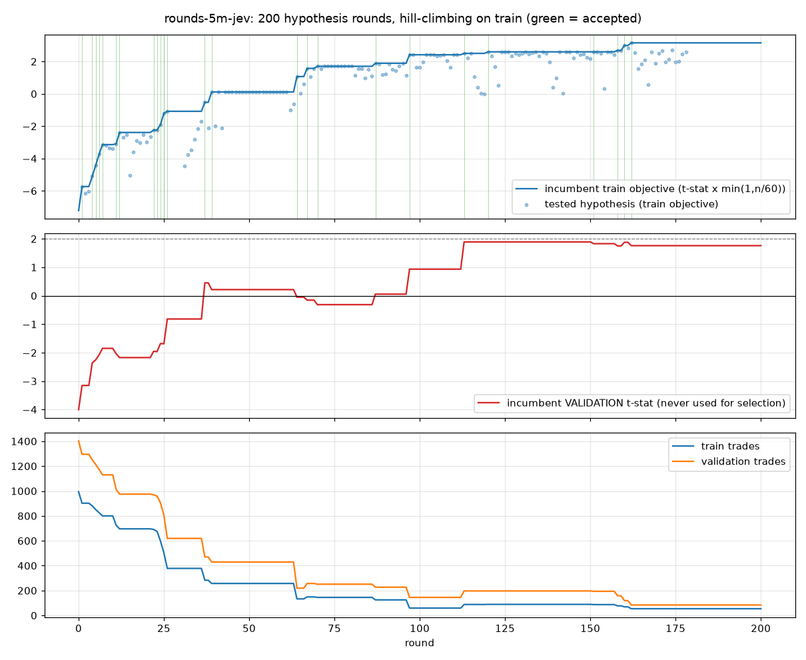

# Research loop report: rounds-5m-jev

200 rounds, 25 accepted, 34 s of compute (all Jev decisions cached).

## Trajectory



## Start vs end

| config | train n | train R | train t | val n | val R | val t | val pf | val return % | val maxDD % |
|---|---|---|---|---|---|---|---|---|---|
| start | 994 | -0.294 | -7.217 | 1402 | -0.137 | -4.001 | 0.868 | -47.480 | -48.329 |
| final | 54 | 0.487 | 3.504 | 84 | 0.214 | 1.760 | 1.709 | 6.302 | -2.192 |

## Accepted steps (in order)

| round | phase | name | obj | t_n | t_R | v_n | v_R | v_t |
|---|---|---|---|---|---|---|---|---|
| 1 | A-execution | entry: resting limit at signal close (maker) instead of market | -5.733 | 902 | -0.240 | 1295 | -0.112 | -3.151 |
| 4 | A-exits | stop = 1.2 ATR | -5.098 | 881 | -0.197 | 1250 | -0.077 | -2.358 |
| 5 | A-exits | stop = 1.4 ATR | -4.428 | 851 | -0.161 | 1214 | -0.069 | -2.254 |
| 6 | A-exits | stop = 1.6 ATR | -3.731 | 826 | -0.128 | 1174 | -0.060 | -2.078 |
| 7 | A-exits | stop = 2.0 ATR | -3.138 | 800 | -0.096 | 1130 | -0.047 | -1.848 |
| 11 | A-exits | target = 2.5 ATR | -3.087 | 725 | -0.120 | 1013 | -0.068 | -2.038 |
| 12 | A-exits | target = 3.0 ATR | -2.387 | 696 | -0.100 | 975 | -0.078 | -2.172 |
| 22 | A-costs | trade only when 1 ATR >= 1.0 x round-trip cost | -2.240 | 691 | -0.094 | 970 | -0.070 | -1.951 |
| 23 | A-costs | trade only when 1 ATR >= 1.5 x round-trip cost | -2.240 | 675 | -0.095 | 959 | -0.071 | -1.963 |
| 24 | A-costs | trade only when 1 ATR >= 2.0 x round-trip cost | -1.892 | 598 | -0.085 | 904 | -0.062 | -1.679 |
| 25 | A-costs | trade only when 1 ATR >= 3.0 x round-trip cost | -1.202 | 502 | -0.059 | 806 | -0.066 | -1.687 |
| 26 | A-costs | trade only when 1 ATR >= 4.0 x round-trip cost | -1.078 | 378 | -0.060 | 619 | -0.036 | -0.817 |
| 37 | B-setups | disable vwap_reversion | -0.522 | 283 | -0.033 | 470 | 0.023 | 0.453 |
| 39 | B-setups | disable range_breakout | 0.118 | 257 | 0.008 | 429 | 0.012 | 0.216 |
| 64 | B-pullback | pullback: HTF slope >= 0.4 | 1.070 | 133 | 0.098 | 219 | -0.004 | -0.049 |
| 67 | B-pullback | pullback: touch tolerance 0.3 ATR | 1.576 | 149 | 0.137 | 257 | -0.011 | -0.155 |
| 70 | B-pullback | pullback: RSI band 45-55 | 1.704 | 145 | 0.149 | 251 | -0.022 | -0.313 |
| 87 | C-time | exclude UTC hours 4-7 | 1.892 | 125 | 0.177 | 227 | 0.004 | 0.056 |
| 97 | C-regime | skip quiet bars, volume < 1.2 x median | 2.418 | 59 | 0.340 | 145 | 0.088 | 0.933 |
| 113 | D-panel | panel threshold 0.4 | 2.503 | 88 | 0.289 | 197 | 0.153 | 1.891 |
| 120 | D-panel | no veto on action == skip | 2.598 | 89 | 0.298 | 197 | 0.153 | 1.891 |
| 151 | D-risk | max 4 trades per coin per day | 2.599 | 87 | 0.300 | 194 | 0.149 | 1.829 |
| 158 | E-coins | drop ZEC | 2.687 | 77 | 0.329 | 158 | 0.158 | 1.750 |
| 160 | E-coins | drop NEAR | 2.989 | 69 | 0.377 | 119 | 0.194 | 1.878 |
| 162 | E-coins | drop PUMP | 3.153 | 54 | 0.487 | 84 | 0.214 | 1.760 |

## Measurements (cost sensitivity, robustness, walk-forward, ablations)

| round | phase | name | t_n | t_R | t_t | v_n | v_R | v_t |
|---|---|---|---|---|---|---|---|---|
| 27 | A-costs | cost sensitivity: target exits also pay taker | 378 | -0.069 | -1.250 | 619 | -0.046 | -1.049 |
| 28 | A-costs | cost sensitivity: zero slippage | 378 | -0.057 | -1.026 | 619 | -0.033 | -0.751 |
| 29 | A-costs | cost sensitivity: 2 bps slippage | 378 | -0.069 | -1.235 | 619 | -0.045 | -1.011 |
| 30 | A-costs | cost sensitivity: all fills taker, 1 bp slippage | 396 | -0.105 | -1.955 | 643 | -0.094 | -2.188 |
| 112 | D-panel | measure: deterministic layer alone (panel OFF) at this point | 89 | 0.298 | 2.598 | 201 | 0.141 | 1.760 |
| 179 | E-robustness | robustness: sl_atr x 0.9 | 54 | 0.478 | 3.051 | 84 | 0.262 | 1.999 |
| 180 | E-robustness | robustness: sl_atr x 1.1 | 54 | 0.426 | 3.278 | 84 | 0.163 | 1.418 |
| 181 | E-robustness | robustness: tp_atr x 0.9 | 54 | 0.467 | 3.521 | 84 | 0.228 | 1.915 |
| 182 | E-robustness | robustness: tp_atr x 1.1 | 54 | 0.457 | 3.118 | 84 | 0.246 | 1.947 |
| 183 | E-robustness | robustness: max_bars x 0.8 | 54 | 0.447 | 3.221 | 84 | 0.179 | 1.523 |
| 184 | E-robustness | robustness: max_bars x 1.25 | 54 | 0.420 | 2.866 | 84 | 0.186 | 1.469 |
| 185 | E-robustness | robustness: panel threshold -0.05 | 54 | 0.487 | 3.504 | 86 | 0.214 | 1.774 |
| 186 | E-robustness | robustness: panel threshold +0.05 | 52 | 0.480 | 3.372 | 80 | 0.187 | 1.488 |
| 187 | E-walkforward | walk-forward: quarter 1 of the full period | 3 | 0.730 | 1.872 | 3 | 0.730 | 1.872 |
| 188 | E-walkforward | walk-forward: quarter 2 of the full period | 0 | 0.000 | 0.000 | 0 | 0.000 | 0.000 |
| 189 | E-walkforward | walk-forward: quarter 3 of the full period | 60 | 0.423 | 3.162 | 60 | 0.423 | 3.162 |
| 190 | E-walkforward | walk-forward: quarter 4 of the full period | 75 | 0.222 | 1.703 | 75 | 0.222 | 1.703 |
| 191 | E-ablation | ablation: final config WITHOUT panel | 54 | 0.487 | 3.504 | 87 | 0.199 | 1.656 |
| 192 | E-ablation | ablation: final config with the offline mock panel | 54 | 0.487 | 3.504 | 87 | 0.199 | 1.656 |
| 193 | E-ablation | ablation: revert 'entry: resting limit at signal close (maker) instead of market' | 55 | 0.448 | 3.175 | 87 | 0.189 | 1.587 |
| 194 | E-ablation | ablation: revert 'stop = 1.2 ATR' | 57 | 0.661 | 2.596 | 85 | 0.284 | 1.420 |
| 195 | E-ablation | ablation: revert 'stop = 1.4 ATR' | 57 | 0.661 | 2.596 | 85 | 0.284 | 1.420 |
| 196 | E-ablation | ablation: revert 'stop = 1.6 ATR' | 57 | 0.661 | 2.596 | 85 | 0.284 | 1.420 |
| 197 | E-ablation | ablation: revert 'stop = 2.0 ATR' | 57 | 0.661 | 2.596 | 85 | 0.284 | 1.420 |
| 198 | E-ablation | ablation: revert 'target = 2.5 ATR' | 56 | 0.224 | 2.374 | 85 | 0.150 | 1.737 |
| 199 | E-ablation | ablation: revert 'target = 3.0 ATR' | 56 | 0.224 | 2.374 | 85 | 0.150 | 1.737 |
| 200 | E-ablation | ablation: revert 'trade only when 1 ATR >= 1.0 x round-trip cost' | 213 | -0.138 | -1.649 | 240 | -0.019 | -0.262 |

## Ablation of each accepted step from the final configuration

| round | reverted step | train obj without it | contribution to train obj | contribution to val R | val R without it | val n |
|---|---|---|---|---|---|---|
| 193 | 'entry: resting limit at signal close (maker) instead of market' | 2.910 | 0.243 | 0.025 | 0.189 | 87 |
| 194 | 'stop = 1.2 ATR' | 2.466 | 0.687 | -0.070 | 0.284 | 85 |
| 195 | 'stop = 1.4 ATR' | 2.466 | 0.687 | -0.070 | 0.284 | 85 |
| 196 | 'stop = 1.6 ATR' | 2.466 | 0.687 | -0.070 | 0.284 | 85 |
| 197 | 'stop = 2.0 ATR' | 2.466 | 0.687 | -0.070 | 0.284 | 85 |
| 198 | 'target = 2.5 ATR' | 2.216 | 0.937 | 0.064 | 0.150 | 85 |
| 199 | 'target = 3.0 ATR' | 2.216 | 0.937 | 0.064 | 0.150 | 85 |
| 200 | 'trade only when 1 ATR >= 1.0 x round-trip cost' | -1.649 | 4.802 | 0.233 | -0.019 | 240 |

## Final configuration

```
{
 "setup": {
  "mr_enabled": false,
  "mr_dist_atr": 2.0,
  "mr_rsi_low": 30.0,
  "mr_rsi_high": 70.0,
  "mr_wick_min": 0.35,
  "mr_vol_z_min": 1.0,
  "mr_max_htf_slope": 0.8,
  "pb_enabled": true,
  "pb_min_htf_slope": 0.4,
  "pb_rsi_lo": 45.0,
  "pb_rsi_hi": 55.0,
  "pb_touch_tol_atr": 0.3,
  "bo_enabled": false,
  "bo_vol_z_min": 1.5,
  "bo_atr_regime_min": 0.9,
  "bo_min_body": 0.5,
  "sl_atr": 2.0,
  "tp_atr": 3.0,
  "max_bars": 24,
  "sessions": [
   "asia",
   "europe",
   "us",
   "late"
  ],
  "entry_mode": "limit",
  "tp_mode": "atr",
  "min_atr_cost_ratio": 4.0,
  "cost_bps_ref": 10.0,
  "max_vol_z": 99.0,
  "min_vol_z": 1.2,
  "atr_regime_min": 0.0,
  "atr_regime_max": 99.0,
  "max_abs_streak": 99,
  "htf2_align": false,
  "htf2_fade": false,
  "exclude_hours": [
   4,
   5,
   6,
   7
  ],
  "weekdays_only": false,
  "long_only": false,
  "short_only": false,
  "coins": [
   "BTC",
   "ETH",
   "HYPE",
   "SOL",
   "XRP",
   "ONDO",
   "ENA"
  ],
  "max_range_atr": 99.0,
  "min_range_atr": 0.0,
  "bb_z_abs_max": 99.0,
  "cooldown_bars": 0,
  "max_trades_per_day": 4
 },
 "panel": {
  "enabled": true,
  "w_setup": 1.0,
  "w_regime": 0.8,
  "w_htf": 0.8,
  "w_exhaustion": 0.4,
  "w_cost": 0.6,
  "w_quality": 1.2,
  "threshold": 0.4,
  "min_action_conf": 0.0,
  "veto_skip": false,
  "size_by_quality": true,
  "require_take": false,
  "use_p_take": false,
  "threshold_by_setup": {}
 }
}
```

## All rounds

| round | phase | kind | name | decision | obj | t_n | t_R | v_n | v_R | v_t |
|---|---|---|---|---|---|---|---|---|---|---|
| 0 | base | base | starting point | baseline | -7.217 | 994 | -0.294 | 1402 | -0.137 | -4.001 |
| 1 | A-execution | mutate | entry: resting limit at signal close (maker) instead of market | ACCEPT | -5.733 | 902 | -0.240 | 1295 | -0.112 | -3.151 |
| 2 | A-exits | mutate | stop = 0.7 ATR | reject | -6.158 | 954 | -0.301 | 1377 | -0.176 | -4.248 |
| 3 | A-exits | mutate | stop = 0.85 ATR | reject | -6.009 | 936 | -0.268 | 1335 | -0.134 | -3.529 |
| 4 | A-exits | mutate | stop = 1.2 ATR | ACCEPT | -5.098 | 881 | -0.197 | 1250 | -0.077 | -2.358 |
| 5 | A-exits | mutate | stop = 1.4 ATR | ACCEPT | -4.428 | 851 | -0.161 | 1214 | -0.069 | -2.254 |
| 6 | A-exits | mutate | stop = 1.6 ATR | ACCEPT | -3.731 | 826 | -0.128 | 1174 | -0.060 | -2.078 |
| 7 | A-exits | mutate | stop = 2.0 ATR | ACCEPT | -3.138 | 800 | -0.096 | 1130 | -0.047 | -1.848 |
| 8 | A-exits | mutate | target = 1.0 ATR | reject | -3.201 | 865 | -0.080 | 1219 | -0.045 | -2.214 |
| 9 | A-exits | mutate | target = 1.2 ATR | reject | -3.342 | 839 | -0.092 | 1184 | -0.045 | -1.967 |
| 10 | A-exits | mutate | target = 2.0 ATR | reject | -3.401 | 755 | -0.120 | 1067 | -0.045 | -1.487 |
| 11 | A-exits | mutate | target = 2.5 ATR | ACCEPT | -3.087 | 725 | -0.120 | 1013 | -0.068 | -2.038 |
| 12 | A-exits | mutate | target = 3.0 ATR | ACCEPT | -2.387 | 696 | -0.100 | 975 | -0.078 | -2.172 |
| 13 | A-exits | mutate | target = 3.5 ATR | reject | -2.685 | 675 | -0.119 | 952 | -0.106 | -2.799 |
| 14 | A-exits | mutate | target = 4.0 ATR | reject | -2.533 | 667 | -0.117 | 930 | -0.105 | -2.679 |
| 15 | A-exits | mutate | time stop = 6 bars | reject | -5.048 | 860 | -0.134 | 1227 | -0.050 | -2.248 |
| 16 | A-exits | mutate | time stop = 9 bars | reject | -3.609 | 803 | -0.112 | 1142 | -0.046 | -1.724 |
| 17 | A-exits | mutate | time stop = 12 bars | reject | -2.889 | 757 | -0.101 | 1078 | -0.057 | -1.901 |
| 18 | A-exits | mutate | time stop = 18 bars | reject | -3.003 | 717 | -0.117 | 1014 | -0.053 | -1.579 |
| 19 | A-exits | mutate | time stop = 36 bars | reject | -2.518 | 679 | -0.113 | 946 | -0.055 | -1.444 |
| 20 | A-exits | mutate | time stop = 60 bars | reject | -2.995 | 664 | -0.140 | 935 | -0.033 | -0.833 |
| 21 | A-exits | mutate | reversion targets the session VWAP instead of a fixed ATR multiple | reject | -2.634 | 694 | -0.112 | 965 | -0.094 | -2.565 |
| 22 | A-costs | mutate | trade only when 1 ATR >= 1.0 x round-trip cost | ACCEPT | -2.240 | 691 | -0.094 | 970 | -0.070 | -1.951 |
| 23 | A-costs | mutate | trade only when 1 ATR >= 1.5 x round-trip cost | ACCEPT | -2.240 | 675 | -0.095 | 959 | -0.071 | -1.963 |
| 24 | A-costs | mutate | trade only when 1 ATR >= 2.0 x round-trip cost | ACCEPT | -1.892 | 598 | -0.085 | 904 | -0.062 | -1.679 |
| 25 | A-costs | mutate | trade only when 1 ATR >= 3.0 x round-trip cost | ACCEPT | -1.202 | 502 | -0.059 | 806 | -0.066 | -1.687 |
| 26 | A-costs | mutate | trade only when 1 ATR >= 4.0 x round-trip cost | ACCEPT | -1.078 | 378 | -0.060 | 619 | -0.036 | -0.817 |
| 27 | A-costs | measure | cost sensitivity: target exits also pay taker | measured | -1.250 | 378 | -0.069 | 619 | -0.046 | -1.049 |
| 28 | A-costs | measure | cost sensitivity: zero slippage | measured | -1.026 | 378 | -0.057 | 619 | -0.033 | -0.751 |
| 29 | A-costs | measure | cost sensitivity: 2 bps slippage | measured | -1.235 | 378 | -0.069 | 619 | -0.045 | -1.011 |
| 30 | A-costs | measure | cost sensitivity: all fills taker, 1 bp slippage | measured | -1.955 | 396 | -0.105 | 643 | -0.094 | -2.188 |
| 31 | A-exits | mutate | joint exits stop 0.8 / target 1.2 ATR | reject | -4.455 | 554 | -0.234 | 883 | -0.094 | -2.194 |
| 32 | A-exits | mutate | joint exits stop 0.8 / target 2.0 ATR | reject | -3.763 | 523 | -0.251 | 830 | -0.045 | -0.796 |
| 33 | A-exits | mutate | joint exits stop 1.0 / target 2.0 ATR | reject | -3.475 | 491 | -0.214 | 794 | -0.066 | -1.293 |
| 34 | A-exits | mutate | joint exits stop 1.2 / target 1.8 ATR | reject | -2.818 | 478 | -0.156 | 772 | -0.045 | -0.993 |
| 35 | A-exits | mutate | joint exits stop 1.2 / target 2.4 ATR | reject | -2.161 | 460 | -0.137 | 723 | -0.052 | -0.991 |
| 36 | A-exits | mutate | joint exits stop 1.5 / target 1.5 ATR | reject | -1.717 | 473 | -0.079 | 768 | -0.069 | -1.892 |
| 37 | B-setups | mutate | disable vwap_reversion | ACCEPT | -0.522 | 283 | -0.033 | 470 | 0.023 | 0.453 |
| 38 | B-setups | mutate | disable trend_pullback | reject | -2.127 | 53 | -0.342 | 75 | 0.019 | 0.146 |
| 39 | B-setups | mutate | disable range_breakout | ACCEPT | 0.118 | 257 | 0.008 | 429 | 0.012 | 0.216 |
| 40 | B-setups | mutate | only vwap_reversion | reject | -1.987 | 115 | -0.201 | 211 | -0.115 | -1.513 |
| 41 | B-setups | mutate | only trend_pullback | reject | 0.118 | 257 | 0.008 | 429 | 0.012 | 0.216 |
| 42 | B-setups | mutate | only range_breakout | reject | -2.127 | 53 | -0.342 | 75 | 0.019 | 0.146 |
| 43 | B-reversion | mutate | reversion: extension >= 1.5 ATR from VWAP | reject | 0.118 | 257 | 0.008 | 429 | 0.012 | 0.216 |
| 44 | B-reversion | mutate | reversion: extension >= 1.75 ATR from VWAP | reject | 0.118 | 257 | 0.008 | 429 | 0.012 | 0.216 |
| 45 | B-reversion | mutate | reversion: extension >= 2.25 ATR from VWAP | reject | 0.118 | 257 | 0.008 | 429 | 0.012 | 0.216 |
| 46 | B-reversion | mutate | reversion: extension >= 2.5 ATR from VWAP | reject | 0.118 | 257 | 0.008 | 429 | 0.012 | 0.216 |
| 47 | B-reversion | mutate | reversion: extension >= 3.0 ATR from VWAP | reject | 0.118 | 257 | 0.008 | 429 | 0.012 | 0.216 |
| 48 | B-reversion | mutate | reversion: RSI extremes 35/65 | reject | 0.118 | 257 | 0.008 | 429 | 0.012 | 0.216 |
| 49 | B-reversion | mutate | reversion: RSI extremes 25/75 | reject | 0.118 | 257 | 0.008 | 429 | 0.012 | 0.216 |
| 50 | B-reversion | mutate | reversion: RSI extremes 22/78 | reject | 0.118 | 257 | 0.008 | 429 | 0.012 | 0.216 |
| 51 | B-reversion | mutate | reversion: RSI extremes 38/62 | reject | 0.118 | 257 | 0.008 | 429 | 0.012 | 0.216 |
| 52 | B-reversion | mutate | reversion: rejection wick >= 0.2 | reject | 0.118 | 257 | 0.008 | 429 | 0.012 | 0.216 |
| 53 | B-reversion | mutate | reversion: rejection wick >= 0.45 | reject | 0.118 | 257 | 0.008 | 429 | 0.012 | 0.216 |
| 54 | B-reversion | mutate | reversion: rejection wick >= 0.5 | reject | 0.118 | 257 | 0.008 | 429 | 0.012 | 0.216 |
| 55 | B-reversion | mutate | reversion: volume >= 0.7 x median | reject | 0.118 | 257 | 0.008 | 429 | 0.012 | 0.216 |
| 56 | B-reversion | mutate | reversion: volume >= 1.5 x median | reject | 0.118 | 257 | 0.008 | 429 | 0.012 | 0.216 |
| 57 | B-reversion | mutate | reversion: volume >= 2.0 x median | reject | 0.118 | 257 | 0.008 | 429 | 0.012 | 0.216 |
| 58 | B-reversion | mutate | reversion: do not fade HTF slope beyond 0.4 | reject | 0.118 | 257 | 0.008 | 429 | 0.012 | 0.216 |
| 59 | B-reversion | mutate | reversion: do not fade HTF slope beyond 1.0 | reject | 0.118 | 257 | 0.008 | 429 | 0.012 | 0.216 |
| 60 | B-reversion | mutate | reversion: do not fade HTF slope beyond 1.5 | reject | 0.118 | 257 | 0.008 | 429 | 0.012 | 0.216 |
| 61 | B-reversion | mutate | reversion: highest timeframe must agree with the fade | reject | 0.118 | 257 | 0.008 | 429 | 0.012 | 0.216 |
| 62 | B-pullback | mutate | pullback: HTF slope >= 0.05 | reject | -1.002 | 324 | -0.060 | 535 | 0.008 | 0.157 |
| 63 | B-pullback | mutate | pullback: HTF slope >= 0.1 | reject | -0.645 | 309 | -0.040 | 503 | 0.013 | 0.268 |
| 64 | B-pullback | mutate | pullback: HTF slope >= 0.4 | ACCEPT | 1.070 | 133 | 0.098 | 219 | -0.004 | -0.049 |
| 65 | B-pullback | mutate | pullback: HTF slope >= 0.6 | reject | 0.029 | 60 | 0.004 | 65 | -0.114 | -0.860 |
| 66 | B-pullback | mutate | pullback: touch tolerance 0.05 ATR | reject | 0.615 | 120 | 0.059 | 191 | -0.002 | -0.027 |
| 67 | B-pullback | mutate | pullback: touch tolerance 0.3 ATR | ACCEPT | 1.576 | 149 | 0.137 | 257 | -0.011 | -0.155 |
| 68 | B-pullback | mutate | pullback: touch tolerance 0.4 ATR | reject | 1.070 | 156 | 0.091 | 273 | -0.031 | -0.470 |
| 69 | B-pullback | mutate | pullback: RSI band 30-70 | reject | 1.576 | 149 | 0.137 | 257 | -0.011 | -0.155 |
| 70 | B-pullback | mutate | pullback: RSI band 45-55 | ACCEPT | 1.704 | 145 | 0.149 | 251 | -0.022 | -0.313 |
| 71 | B-pullback | mutate | pullback: RSI band 40-65 | reject | 1.576 | 149 | 0.137 | 257 | -0.011 | -0.155 |
| 72 | B-breakout | mutate | breakout: volume >= 1.0 x median | reject | 1.704 | 145 | 0.149 | 251 | -0.022 | -0.313 |
| 73 | B-breakout | mutate | breakout: volume >= 2.0 x median | reject | 1.704 | 145 | 0.149 | 251 | -0.022 | -0.313 |
| 74 | B-breakout | mutate | breakout: volume >= 3.0 x median | reject | 1.704 | 145 | 0.149 | 251 | -0.022 | -0.313 |
| 75 | B-breakout | mutate | breakout: volatility regime >= 0.7 | reject | 1.704 | 145 | 0.149 | 251 | -0.022 | -0.313 |
| 76 | B-breakout | mutate | breakout: volatility regime >= 1.1 | reject | 1.704 | 145 | 0.149 | 251 | -0.022 | -0.313 |
| 77 | B-breakout | mutate | breakout: volatility regime >= 1.4 | reject | 1.704 | 145 | 0.149 | 251 | -0.022 | -0.313 |
| 78 | B-breakout | mutate | breakout: body >= 0.35 of range | reject | 1.704 | 145 | 0.149 | 251 | -0.022 | -0.313 |
| 79 | B-breakout | mutate | breakout: body >= 0.6 of range | reject | 1.704 | 145 | 0.149 | 251 | -0.022 | -0.313 |
| 80 | B-breakout | mutate | breakout: body >= 0.75 of range | reject | 1.704 | 145 | 0.149 | 251 | -0.022 | -0.313 |
| 81 | B-setups | mutate | trend setups must agree with the highest timeframe | reject | 1.147 | 123 | 0.110 | 208 | -0.059 | -0.782 |
| 82 | C-time | mutate | sessions europe+us only | reject | 1.576 | 84 | 0.184 | 161 | 0.091 | 1.042 |
| 83 | C-time | mutate | sessions us only | reject | 1.566 | 54 | 0.247 | 107 | 0.072 | 0.722 |
| 84 | C-time | mutate | sessions asia+europe only | reject | 0.991 | 77 | 0.121 | 126 | -0.121 | -1.194 |
| 85 | C-time | mutate | sessions europe+us+late only | reject | 1.518 | 98 | 0.161 | 185 | 0.082 | 1.002 |
| 86 | C-time | mutate | exclude UTC hours 0-3 | reject | 1.120 | 116 | 0.111 | 203 | 0.055 | 0.717 |
| 87 | C-time | mutate | exclude UTC hours 4-7 | ACCEPT | 1.892 | 125 | 0.177 | 227 | 0.004 | 0.056 |
| 88 | C-time | mutate | exclude UTC hours 8-11 | reject | 1.831 | 123 | 0.173 | 219 | -0.068 | -0.938 |
| 89 | C-time | mutate | exclude UTC hours 12-15 | reject | 1.202 | 123 | 0.114 | 185 | -0.080 | -1.010 |
| 90 | C-time | mutate | exclude UTC hours 16-19 | reject | 1.229 | 117 | 0.122 | 215 | -0.004 | -0.047 |
| 91 | C-time | mutate | exclude UTC hours 20-23 | reject | 1.842 | 127 | 0.172 | 220 | -0.052 | -0.693 |
| 92 | C-time | mutate | weekdays only | reject | 1.498 | 105 | 0.151 | 181 | -0.020 | -0.239 |
| 93 | C-regime | mutate | skip climactic volume > 3.0 x median | reject | 1.444 | 119 | 0.139 | 223 | -0.005 | -0.072 |
| 94 | C-regime | mutate | skip climactic volume > 4.0 x median | reject | 1.739 | 124 | 0.163 | 225 | 0.014 | 0.186 |
| 95 | C-regime | mutate | skip climactic volume > 6.0 x median | reject | 1.892 | 125 | 0.177 | 226 | 0.009 | 0.120 |
| 96 | C-regime | mutate | skip quiet bars, volume < 0.8 x median | reject | 1.134 | 99 | 0.120 | 204 | 0.050 | 0.636 |
| 97 | C-regime | mutate | skip quiet bars, volume < 1.2 x median | ACCEPT | 2.418 | 59 | 0.340 | 145 | 0.088 | 0.933 |
| 98 | C-regime | mutate | volatility regime window 0.8-99.0 | reject | 2.418 | 59 | 0.340 | 140 | 0.075 | 0.783 |
| 99 | C-regime | mutate | volatility regime window 1.0-99.0 | reject | 1.646 | 53 | 0.274 | 117 | 0.060 | 0.580 |
| 100 | C-regime | mutate | volatility regime window 0.0-1.5 | reject | 1.654 | 46 | 0.352 | 126 | 0.090 | 0.850 |
| 101 | C-regime | mutate | volatility regime window 0.7-1.6 | reject | 1.984 | 52 | 0.345 | 133 | 0.071 | 0.701 |
| 102 | C-regime | mutate | skip after streaks longer than 3 candles | reject | 2.418 | 59 | 0.340 | 143 | 0.104 | 1.095 |
| 103 | C-regime | mutate | skip after streaks longer than 4 candles | reject | 2.418 | 59 | 0.340 | 145 | 0.088 | 0.933 |
| 104 | C-regime | mutate | skip after streaks longer than 6 candles | reject | 2.418 | 59 | 0.340 | 145 | 0.088 | 0.933 |
| 105 | C-regime | mutate | skip signal bars wider than 1.5 ATR | reject | 2.353 | 57 | 0.353 | 130 | 0.100 | 1.002 |
| 106 | C-regime | mutate | skip signal bars wider than 2.0 ATR | reject | 2.362 | 59 | 0.333 | 141 | 0.103 | 1.073 |
| 107 | C-regime | mutate | skip signal bars wider than 3.0 ATR | reject | 2.418 | 59 | 0.340 | 145 | 0.088 | 0.933 |
| 108 | C-regime | mutate | require signal bar >= 0.5 ATR | reject | 2.034 | 57 | 0.301 | 141 | 0.079 | 0.820 |
| 109 | C-regime | mutate | require signal bar >= 0.8 ATR | reject | 1.648 | 50 | 0.303 | 110 | 0.060 | 0.553 |
| 110 | C-regime | mutate | skip when |bollinger z| > 2.0 | reject | 2.418 | 59 | 0.340 | 145 | 0.088 | 0.933 |
| 111 | C-regime | mutate | skip when |bollinger z| > 3.0 | reject | 2.418 | 59 | 0.340 | 145 | 0.088 | 0.933 |
| 112 | D-panel | measure | measure: deterministic layer alone (panel OFF) at this point | measured | 2.598 | 89 | 0.298 | 201 | 0.141 | 1.760 |
| 113 | D-panel | mutate | panel threshold 0.4 | ACCEPT | 2.503 | 88 | 0.289 | 197 | 0.153 | 1.891 |
| 114 | D-panel | mutate | panel threshold 0.45 | reject | 2.216 | 84 | 0.264 | 193 | 0.140 | 1.713 |
| 115 | D-panel | mutate | panel threshold 0.5 | reject | 2.491 | 77 | 0.310 | 178 | 0.149 | 1.744 |
| 116 | D-panel | mutate | panel threshold 0.6 | reject | 1.059 | 44 | 0.234 | 98 | 0.065 | 0.562 |
| 117 | D-panel | mutate | panel threshold 0.65 | reject (too few train trades) | 0.390 | 28 | 0.175 | 66 | -0.016 | -0.112 |
| 118 | D-panel | mutate | panel threshold 0.7 | reject (too few train trades) | 0.029 | 10 | 0.068 | 23 | -0.055 | -0.222 |
| 119 | D-panel | mutate | panel threshold 0.75 | reject (too few train trades) | 0.000 | 0 | 0.000 | 7 | -0.170 | -0.374 |
| 120 | D-panel | mutate | no veto on action == skip | ACCEPT | 2.598 | 89 | 0.298 | 197 | 0.153 | 1.891 |
| 121 | D-panel | mutate | require action confidence >= 0.2 | reject | 2.341 | 86 | 0.274 | 194 | 0.155 | 1.902 |
| 122 | D-panel | mutate | require action confidence >= 0.4 | reject | 1.699 | 66 | 0.229 | 139 | 0.199 | 2.048 |
| 123 | D-panel | mutate | require action confidence >= 0.6 | reject (too few train trades) | 0.546 | 22 | 0.355 | 41 | 0.061 | 0.319 |
| 124 | D-panel | mutate | size by quality OFF | reject | 2.598 | 89 | 0.298 | 197 | 0.153 | 1.891 |
| 125 | D-panel | mutate | size by quality ON | reject | 2.598 | 89 | 0.298 | 197 | 0.153 | 1.891 |
| 126 | D-panel | mutate | panel weight w_setup = 0 | reject | 2.598 | 89 | 0.298 | 200 | 0.147 | 1.833 |
| 127 | D-panel | mutate | panel weight w_setup = 2 | reject | 2.347 | 85 | 0.279 | 195 | 0.154 | 1.886 |
| 128 | D-panel | mutate | panel weight w_regime = 0 | reject | 2.523 | 87 | 0.295 | 197 | 0.139 | 1.711 |
| 129 | D-panel | mutate | panel weight w_regime = 2 | reject | 2.423 | 87 | 0.282 | 195 | 0.154 | 1.886 |
| 130 | D-panel | mutate | panel weight w_htf = 0 | reject | 2.491 | 77 | 0.310 | 180 | 0.151 | 1.782 |
| 131 | D-panel | mutate | panel weight w_htf = 2 | reject | 2.598 | 89 | 0.298 | 200 | 0.147 | 1.833 |
| 132 | D-panel | mutate | panel weight w_exhaustion = 0 | reject | 2.470 | 88 | 0.285 | 197 | 0.152 | 1.877 |
| 133 | D-panel | mutate | panel weight w_exhaustion = 2 | reject | 2.560 | 87 | 0.300 | 196 | 0.141 | 1.739 |
| 134 | D-panel | mutate | panel weight w_cost = 0 | reject | 2.598 | 89 | 0.298 | 199 | 0.154 | 1.905 |
| 135 | D-panel | mutate | panel weight w_cost = 2 | reject | 2.347 | 85 | 0.279 | 195 | 0.141 | 1.727 |
| 136 | D-panel | mutate | panel weight w_quality = 0 | reject | 2.598 | 89 | 0.298 | 200 | 0.147 | 1.833 |
| 137 | D-panel | mutate | panel weight w_quality = 2 | reject | 2.523 | 87 | 0.295 | 195 | 0.154 | 1.886 |
| 138 | D-panel | mutate | panel: quality only | reject | 1.987 | 60 | 0.278 | 141 | 0.146 | 1.520 |
| 139 | D-panel | mutate | panel: setup_valid only | reject (too few train trades) | 0.407 | 23 | 0.232 | 72 | 0.079 | 0.602 |
| 140 | D-panel | mutate | panel: gate on p(take) instead of the weighted mix | reject (too few train trades) | 0.991 | 29 | 0.402 | 77 | 0.008 | 0.061 |
| 141 | D-panel | mutate | panel: weighted mix again | reject | 2.598 | 89 | 0.298 | 197 | 0.153 | 1.891 |
| 142 | D-panel | mutate | panel: require action == take | reject (too few train trades) | 0.034 | 2 | 0.741 | 10 | -0.292 | -0.892 |
| 143 | D-panel | mutate | panel: do not require action == take | reject | 2.598 | 89 | 0.298 | 197 | 0.153 | 1.891 |
| 144 | D-panel | mutate | panel: stricter threshold for breakouts (+0.1) | reject | 2.598 | 89 | 0.298 | 197 | 0.153 | 1.891 |
| 145 | D-panel | mutate | panel: looser threshold for pullbacks (-0.1) | reject | 2.216 | 84 | 0.264 | 193 | 0.140 | 1.713 |
| 146 | D-panel | mutate | panel OFF: keep the deterministic layer alone if it beats the tuned panel | reject | 2.598 | 89 | 0.298 | 201 | 0.141 | 1.760 |
| 147 | D-risk | mutate | cooldown 3 bars after each exit | reject | 2.441 | 87 | 0.284 | 196 | 0.146 | 1.804 |
| 148 | D-risk | mutate | cooldown 6 bars after each exit | reject | 2.473 | 87 | 0.289 | 191 | 0.164 | 2.005 |
| 149 | D-risk | mutate | cooldown 12 bars after each exit | reject | 2.271 | 81 | 0.276 | 181 | 0.151 | 1.809 |
| 150 | D-risk | mutate | max 2 trades per coin per day | reject | 2.175 | 77 | 0.264 | 171 | 0.122 | 1.428 |
| 151 | D-risk | mutate | max 4 trades per coin per day | ACCEPT | 2.599 | 87 | 0.300 | 194 | 0.149 | 1.829 |
| 152 | D-risk | mutate | max 8 trades per coin per day | reject | 2.598 | 89 | 0.298 | 197 | 0.153 | 1.891 |
| 153 | E-direction | mutate | long only | reject | 2.505 | 61 | 0.341 | 129 | 0.149 | 1.430 |
| 154 | E-direction | mutate | short only | reject (too few train trades) | 0.324 | 27 | 0.156 | 66 | 0.132 | 1.019 |
| 155 | E-direction | mutate | both directions (restore) | reject | 2.599 | 87 | 0.300 | 194 | 0.149 | 1.829 |
| 156 | E-coins | mutate | drop BTC | reject | 2.599 | 87 | 0.300 | 194 | 0.149 | 1.829 |
| 157 | E-coins | mutate | drop ETH | reject | 2.441 | 81 | 0.299 | 193 | 0.149 | 1.812 |
| 158 | E-coins | mutate | drop ZEC | ACCEPT | 2.687 | 77 | 0.329 | 158 | 0.158 | 1.750 |
| 159 | E-coins | mutate | drop HYPE | reject | 2.687 | 77 | 0.329 | 151 | 0.142 | 1.519 |
| 160 | E-coins | mutate | drop NEAR | ACCEPT | 2.989 | 69 | 0.377 | 119 | 0.194 | 1.878 |
| 161 | E-coins | mutate | drop SOL | reject | 2.817 | 64 | 0.373 | 112 | 0.202 | 1.895 |
| 162 | E-coins | mutate | drop PUMP | ACCEPT | 3.153 | 54 | 0.487 | 84 | 0.214 | 1.760 |
| 163 | E-coins | mutate | drop XRP | reject | 2.545 | 44 | 0.530 | 70 | 0.247 | 1.853 |
| 164 | E-coins | mutate | drop ONDO | reject | 1.561 | 40 | 0.376 | 63 | 0.211 | 1.514 |
| 165 | E-coins | mutate | drop ENA | reject (too few train trades) | 1.852 | 35 | 0.519 | 50 | 0.192 | 1.264 |
| 166 | E-coins | mutate | only high-ATR coins (ZEC, NEAR, ENA, PUMP, HYPE, ONDO) | reject | 2.090 | 66 | 0.290 | 172 | 0.160 | 1.836 |
| 167 | E-coins | mutate | only majors (BTC, ETH, SOL, XRP) | reject (too few train trades) | 0.577 | 21 | 0.331 | 22 | 0.064 | 0.273 |
| 168 | E-coins | mutate | all coins (restore) | reject | 2.599 | 87 | 0.300 | 194 | 0.149 | 1.829 |
| 169 | E-refine | mutate | re-sweep sp_sl_atr = 0.9 | reject | 1.875 | 59 | 0.514 | 86 | 0.349 | 1.618 |
| 170 | E-refine | mutate | re-sweep sp_sl_atr = 1.1 | reject | 2.495 | 56 | 0.631 | 85 | 0.332 | 1.761 |
| 171 | E-refine | mutate | re-sweep sp_sl_atr = 1.3 | reject | 2.650 | 55 | 0.612 | 84 | 0.321 | 1.925 |
| 172 | E-refine | mutate | re-sweep sp_tp_atr = 1.4 | reject | 1.970 | 56 | 0.193 | 85 | 0.128 | 1.512 |
| 173 | E-refine | mutate | re-sweep sp_tp_atr = 1.8 | reject | 2.118 | 55 | 0.244 | 84 | 0.164 | 1.717 |
| 174 | E-refine | mutate | re-sweep sp_tp_atr = 2.2 | reject | 2.695 | 55 | 0.345 | 84 | 0.167 | 1.555 |
| 175 | E-refine | mutate | re-sweep pp_threshold = 0.52 | reject | 1.961 | 44 | 0.417 | 70 | 0.174 | 1.310 |
| 176 | E-refine | mutate | re-sweep pp_threshold = 0.58 | reject (too few train trades) | 2.001 | 37 | 0.526 | 47 | 0.182 | 1.135 |
| 177 | E-refine | mutate | re-sweep sp_max_bars = 15 | reject | 2.463 | 55 | 0.360 | 84 | 0.196 | 1.717 |
| 178 | E-refine | mutate | re-sweep sp_max_bars = 30 | reject | 2.579 | 54 | 0.420 | 84 | 0.186 | 1.469 |
| 179 | E-robustness | measure | robustness: sl_atr x 0.9 | measured | 2.746 | 54 | 0.478 | 84 | 0.262 | 1.999 |
| 180 | E-robustness | measure | robustness: sl_atr x 1.1 | measured | 2.950 | 54 | 0.426 | 84 | 0.163 | 1.418 |
| 181 | E-robustness | measure | robustness: tp_atr x 0.9 | measured | 3.169 | 54 | 0.467 | 84 | 0.228 | 1.915 |
| 182 | E-robustness | measure | robustness: tp_atr x 1.1 | measured | 2.806 | 54 | 0.457 | 84 | 0.246 | 1.947 |
| 183 | E-robustness | measure | robustness: max_bars x 0.8 | measured | 2.899 | 54 | 0.447 | 84 | 0.179 | 1.523 |
| 184 | E-robustness | measure | robustness: max_bars x 1.25 | measured | 2.579 | 54 | 0.420 | 84 | 0.186 | 1.469 |
| 185 | E-robustness | measure | robustness: panel threshold -0.05 | measured | 3.153 | 54 | 0.487 | 86 | 0.214 | 1.774 |
| 186 | E-robustness | measure | robustness: panel threshold +0.05 | measured | 2.923 | 52 | 0.480 | 80 | 0.187 | 1.488 |
| 187 | E-walkforward | measure | walk-forward: quarter 1 of the full period | measured | 0.094 | 3 | 0.730 | 3 | 0.730 | 1.872 |
| 188 | E-walkforward | measure | walk-forward: quarter 2 of the full period | measured | 0.000 | 0 | 0.000 | 0 | 0.000 | 0.000 |
| 189 | E-walkforward | measure | walk-forward: quarter 3 of the full period | measured | 3.162 | 60 | 0.423 | 60 | 0.423 | 3.162 |
| 190 | E-walkforward | measure | walk-forward: quarter 4 of the full period | measured | 1.703 | 75 | 0.222 | 75 | 0.222 | 1.703 |
| 191 | E-ablation | measure | ablation: final config WITHOUT panel | measured | 3.153 | 54 | 0.487 | 87 | 0.199 | 1.656 |
| 192 | E-ablation | measure | ablation: final config with the offline mock panel | measured | 3.153 | 54 | 0.487 | 87 | 0.199 | 1.656 |
| 193 | E-ablation | measure | ablation: revert 'entry: resting limit at signal close (maker) instead of market' | measured | 2.910 | 55 | 0.448 | 87 | 0.189 | 1.587 |
| 194 | E-ablation | measure | ablation: revert 'stop = 1.2 ATR' | measured | 2.466 | 57 | 0.661 | 85 | 0.284 | 1.420 |
| 195 | E-ablation | measure | ablation: revert 'stop = 1.4 ATR' | measured | 2.466 | 57 | 0.661 | 85 | 0.284 | 1.420 |
| 196 | E-ablation | measure | ablation: revert 'stop = 1.6 ATR' | measured | 2.466 | 57 | 0.661 | 85 | 0.284 | 1.420 |
| 197 | E-ablation | measure | ablation: revert 'stop = 2.0 ATR' | measured | 2.466 | 57 | 0.661 | 85 | 0.284 | 1.420 |
| 198 | E-ablation | measure | ablation: revert 'target = 2.5 ATR' | measured | 2.216 | 56 | 0.224 | 85 | 0.150 | 1.737 |
| 199 | E-ablation | measure | ablation: revert 'target = 3.0 ATR' | measured | 2.216 | 56 | 0.224 | 85 | 0.150 | 1.737 |
| 200 | E-ablation | measure | ablation: revert 'trade only when 1 ATR >= 1.0 x round-trip cost' | measured | -1.649 | 213 | -0.138 | 240 | -0.019 | -0.262 |
